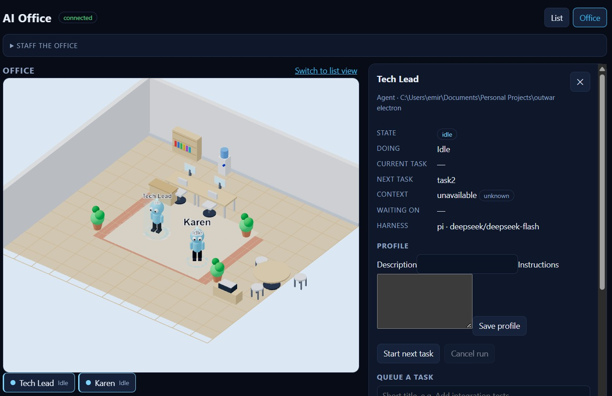

<div align="center">

# 🏢 AI Office

**One bot per coding agent, on a live isometric office floor.**
Click a bot to see what it is doing, what is next, how much context it has burned,
what it is waiting on — and to type into its real terminal.

**Local-first · Vendor-neutral · Spec-driven**

[](https://www.typescriptlang.org/)
[](https://react.dev/)
[](https://threejs.org/)
[](https://nodejs.org/)
[](#-development)
[](openspec)
[](LICENSE)



*Pick a bot → get its state, current and next task, context pressure, dependencies,
profile, queue, and the live run. Drag bots around; the layout is remembered.*

</div>

```
   ┌────────────────────────── 2.5D OFFICE ────────────────────────────┐
   │  Engineering                    Operations                         │
   │  ┌────┐ ┌────┐ ┌────┐           ┌────┐                             │
   │  │ 🤖 │ │ 🤖 │ │ 😰 │           │ 🤖 │     😰 = context critical   │
   │  └────┘ └────┘ └────┘           └────┘     😣 = context warning    │
   │    Ada   Grace   Alan            Lin                              │
   └────────────────────────────────────────────────────────────────────┘
                              │ click a bot
                              ▼
   ┌────────────────────────── INSPECTOR ───────────────────────────────┐
   │ Doing        Working on: Ship the auth refactor                    │
   │ Next task    Add integration tests                                 │
   │ Context      52% of 1.0M tokens          [ stressed ]              │
   │ Waiting on   —                                                     │
   │ $ pi --mode rpc …                                                  │
   │ $ pnpm test                                                        │
   │   ✔ 419 passing                                                    │
   └────────────────────────────────────────────────────────────────────┘
```

## 🎯 What this is

You have several coding agents. Today that means several terminals, no idea which one
is stuck, which is about to run out of context, and which finished the thing the next
one depends on.

**AI Office turns that into something you can look at.** Every agent is a bot on an
isometric floor; every task is a real terminal session underneath it. The harness and
the model are pluggable ports, so swapping vendors never touches the domain or the UI.

## ✨ Features

| | |
|---|---|
| 🤖 **One bot per agent** | Departments become zones on the floor, so parallel work is visible at a glance. |
| 🖱️ **Drag to move** | Move a bot anywhere; it turns to face the way it moves, and the layout survives reloads. |
| 🔍 **Click to inspect** | Current activity, next task, context usage, dependencies, last report, live terminal tail. |
| 😣 **Context pressure moods** | Bots *complain* at 30% context and *stress* at 50% (configurable) — advisory only, never kills a run. |
| 💻 **Real terminal sessions** | One session per task, PTY- or RPC-backed: streaming output, input, scrollback backfill, exit codes. |
| 📨 **Prompt a working agent** | Type into the inspector and the prompt reaches the harness with its own steering semantics. |
| 🎙️ **Prompt by voice** | Speak a prompt; it is transcribed **on your machine**, cleaned of filler words, and held in a review modal until you say *confirm* or send it by hand. |
| 🔗 **Dependencies + parallelism** | Tasks can depend on tasks across agents; independent work runs concurrently, dependents unblock automatically. |
| 🧩 **Vendor-neutral** | Adding a harness or model is one adapter package plus one registry line — never a core, API, or UI change. |
| 🪄 **Replaceable bots** | Point `avatars/manifest.json` at a glTF; with no assets, a built-in procedural bot renders. |
| ✏️ **Editable floor plan** | Add, move, rotate and remove furniture with the existing models; the arrangement is saved in the browser and can be exported/imported as JSON. |
| ♿ **Accessible list view** | The same information without WebGL, fully keyboard-navigable. This is also how CI verifies the UI. |

Stack: **TypeScript 7** (strict, ESM) · **React 19 + Vite 8** · **Three.js** via
@react-three/fiber · **Zustand** · **node:http + ws** · **node-pty** · **Zod 4** ·
**Vitest 5 + Playwright** · **OpenSpec**.

## 🚀 Quickstart

Needs **Node.js ≥ 22.6**. For real runs you also need the **PI CLI** on your `PATH`
(`npm i -g @earendil-works/pi-coding-agent`) and a **DeepSeek API key**.

```bash
git clone https://github.com/kovacevicemir/All-in-one-AI-office.git
cd All-in-one-AI-office
npm install
cp .env.example .env       # then set DEEPSEEK_API_KEY=sk-...
npm run dev                # runtime on :4317, web UI on :5173
```

Open **http://localhost:5173**, then in **Staff the office**:

1. Add a department (e.g. `Engineering`).
2. Add an agent: a name, a real working directory, harness `PI`, model `deepseek-flash`.
3. Create tasks for it, select the bot (or its list row), and hit **Start next task**.
4. Watch the terminal tail fill in and the bot go 🤖 → 😣 → 😰 as context fills.

No PI and no API key? The scripted fake adapter runs the entire UI offline —
`npm run e2e` drives it in Chromium with no credentials and no WebGL.

```bash
npm run dev:web    # web only
npm start          # runtime only, no watch
npm test           # every test group, timed and budget-checked (< 30s each)
npm run test:changed # only the groups your working-tree changes can reach
npm run test:group -- core   # one group
npm run test:list  # groups and the budget
npm run typecheck  # tsc --noEmit, whole repo
npm run e2e        # Playwright browser suite (fake adapter)
npm run check:web  # fail fast if the running dev server renders blank (needs `npm run dev`)
npm run build      # production build of the web app
```

## 🔐 Configuration

`.env` is git-ignored and holds all secrets; the runtime loads it with
`process.loadEnvFile`. `.env.example` documents every variable.

```dotenv
DEEPSEEK_API_KEY=          # required for real runs
#AI_OFFICE_PRESSURE_WARNING=30
#AI_OFFICE_PRESSURE_CRITICAL=50
#AI_OFFICE_PRESSURE_HYSTERESIS=5
#AI_OFFICE_DATA_DIR=.ai-office
#AI_OFFICE_HOST=127.0.0.1
#AI_OFFICE_PORT=4317
```

Pressure thresholds are per-model: a 1M-token model wants very different numbers to a
128K one. Credentials are read at launch and are **never** written to the data
directory or returned over the API — a test asserts that.

## 🏗 How it works

```
┌──────────────┐   HTTP + WebSocket (packages/contracts)   ┌────────────────────┐
│   apps/web   │ ◄────────────────────────────────────────► │   apps/runtime     │
│  React + R3F │        snapshot, then deltas                │  composition root  │
└──────────────┘                                            └─────────┬──────────┘
                                                                      │ ports
                        ┌─────────────────────────────────────────────┼──────────────┐
                        ▼                        ▼                    ▼              ▼
              packages/core              adapter-pi          adapter-session  adapter-store-file
              domain + rules +     PI harness (RPC) +        pipe + pty       write-behind
              ports + pressure     DeepSeek provider         backings         JSON snapshots
```

Two independent ports keep vendors optional: **`HarnessAdapter`** (*how* an agent
process is started, driven, observed) and **`ModelProvider`** (*which* model and
credentials a run uses). PI is the harness, DeepSeek is the model — swapping either is
one package plus one line in `apps/runtime/src/index.ts`. Nothing in `core`, the API
contract, or the UI knows a vendor name, and `test/architecture.test.ts` fails the
build if that changes.

PI runs in **RPC mode** (`pi --mode rpc`) rather than through TUI scraping: it streams
structured events and `get_session_stats` returns
`contextUsage: { tokens, contextWindow, percent }` — the source of the 30% / 50%
pressure signal. Same agent, same system prompt, same tools, no extra model calls, so
results and token cost match a terminal run. A PTY backing covers harnesses that only
speak a terminal.

## 📁 Repository layout

```
openspec/                      # ← the source of truth (specs, changes, config)
packages/
  contracts/                   # zod schemas, event envelope, error shape, version
  core/                        # domain rules, state machine, pressure, ports (pure)
  adapter-pi/                  # PI harness (RPC) + DeepSeek model provider
  adapter-session/             # pipe + pty process backings
  adapter-store-file/          # write-behind atomic JSON snapshots
  adapter-fake/                # scripted harness, memory store/session (test doubles)
apps/
  runtime/                     # composition root: HTTP + WebSocket + hub
  web/                         # React + Three.js office
docs/engineering-guidelines.md # complexity, testability, and layering rules
```

## 📐 Specs and capabilities

Behaviour is specified before it is written; the specs under
[`openspec/specs/`](openspec/specs) are the source of truth, and in-flight work lives
under [`openspec/changes/`](openspec/changes).

| Capability | Covers |
|---|---|
| [`harness-adapters`](openspec/specs/harness-adapters/spec.md) | The two ports, the registry, normalized events, zero-overhead runs, telemetry, interactive prompting, PI + DeepSeek. |
| [`agent-terminals`](openspec/specs/agent-terminals/spec.md) | One session per task, PTY *or* structured backing, streaming, scrollback backfill, teardown. |
| [`agent-orchestration`](openspec/specs/agent-orchestration/spec.md) | Agents, departments, task queues, dependencies, parallel runs, context pressure, delegation, persistence. |
| [`office-runtime-api`](openspec/specs/office-runtime-api/spec.md) | Versioned HTTP + realtime contract, snapshots, filters, error shape, local-first binding. |
| [`office-2d-ui`](openspec/specs/office-2d-ui/spec.md) | Isometric floor, placement and 360° facing, drag-to-move, swappable avatars, pressure-driven visuals, accessible list fallback. |
| `inter-agent-communication` | Derived communication events, the dashed markers, and their summaries. |

## 🪪 Agent profiles

Give an agent a description and standing instructions; they live in one markdown file
per agent and apply to every run without a restart.

```text
<AI_OFFICE_DATA_DIR>/agents/<agentId>.md
```

```markdown
## Description

Tech lead for the payments squad.

## Instructions

You are the tech lead. You own the build and the release checklist.
Run `npm test` before marking work done. Raise blockers to the orchestrator.
```

Description is operator-facing only and capped at 500 characters; instructions are
delivered to the harness as a separate system message (max 20,000 characters). With no
profile, a run is exactly a shell run — the task instruction reaches the harness
byte-for-byte, with no added system prompt and no extra model calls.

## 🎙 Voice prompting

Prompt an agent by speaking instead of typing. A microphone sits next to the prompt box
and next to the **Queue a task** instruction field; the task form's works even when no
agent is running.

1. **Speak** — click **Voice** and talk. Recognized text appears **in the field as you
   speak** (streamed), with filler words (`um`, `uh`, `er`, `erm`, `hmm`, `mhh`, `aa`,
   `äh`, …) removed, spacing and punctuation tidied, and the first letter capitalized.
   Click **Stop** when you are done. Dictation appends to any text already in the field.
2. **Commit** — the microphone never sends anything. Press **Send** (prompt box) or
   **Add to queue** (task form) when the text is right. Edit it first if you like.

**Where the speech comes from.** By default it uses the browser's own streaming speech
engine (the Web Speech API) — no model, no download, no key, text while you talk. That
engine (in Chromium) may send the audio to the browser vendor's service. On browsers
without it, voice falls back to a **fully on-device Whisper model** (Transformers.js in
a Web Worker): record, then review the cleaned transcript in a modal that fills the
field. Either way audio is never written to disk, and the first use downloads and caches
the model (tens of MB) so later runs work offline.

Voice degrades to plain text whenever it cannot work: an unsupported browser or denied
microphone permission disables the microphone with a reason, and typing keeps working.

Tuning lives in `apps/web/src/voice/clean.ts`: change `DEFAULT_FILLER_WORDS` to adjust
the disfluency list.

The on-device fallback model is exercised by an opt-in smoke test over a checked-in clip:

```bash
AI_OFFICE_VOICE_SMOKE=1 npm run test:group -- voice-smoke
```

## 📨 Inter-agent communication

Two agents exchanging work are drawn as a communication, **derived** from interactions
the office already performs — it is not a chat protocol, and nothing is sent between
harnesses. A **delegation** (a task created for another agent) becomes a `request`; a
**hand-off** (a dependent task starting with another agent's results) becomes a
`handoff`, answered on delivery.

The same event shows up in three places — a dashed marker between bots on the floor, a
dashed separator in the session transcript, and a list in the inspector. Hover or
keyboard-focus a marker for the summary (`Ada → Grace`, the ask, the task, the status,
the time). All three render from one pure `describeCommunication`, so they can never
disagree.

## 🏗 Editing the office layout

The furnished office is the **default** layout. In the office view, **Edit layout**
opens a catalogue and a list of everything already placed:

- **Add with a preview** — pick a kind in the catalogue (seating, desks, tech, decor,
  plants, shared). A translucent preview of the item follows the pointer on the floor,
  showing exactly where and how it will land; click the floor to place it, or press
  **Place** to drop it in the middle. Every kind reuses an existing procedural model; no
  new asset is authored.
- **Rotate before placing** — **Rotate 90°** spins the pending item through 0°, 90°,
  180° and 270° before you place it, and the preview shows the chosen orientation.
- **Move** — drag a piece on the floor. Furniture only moves in edit mode, so dragging a
  bot never shifts a desk and moving a desk never shifts a bot.
- **Rotate / Remove** — select an item in the list (or click it), then use **Rotate 90°**
  (all four orientations) or **Remove**.
- **Right-click to remove** — in edit mode, right-clicking a placed item removes it
  immediately, with no selection step. The browser context menu is suppressed.
- **Reset to default** — discard every edit and restore the furnished plan.
- **Export / Import** — save the arrangement to a JSON file and load one back.

Everything above is keyboard-reachable: you never need a pointer to add, remove, or
reset. The layout is saved in the browser, so it survives a reload and a switch between
the office and the list view. An imported file is validated first: an invalid,
unreadable, or unsupported-version file is reported and the current layout is left
alone, and unknown item kinds are skipped with a count rather than failing the import.

### Layout file format

The exported file is a small, versioned document. Coordinates are floor positions in the
same space as agent poses, and `rotation` is a quarter-turn index (`0`–`3`):

```json
{
  "version": 1,
  "items": [
    { "id": "desk_1", "kind": "desk", "x": -1.7, "y": -2.65, "rotation": 0 },
    { "id": "plant_1", "kind": "plant", "x": 3.4, "y": 1.8, "rotation": 1 }
  ]
}
```

`kind` is one of the existing furniture kinds. A piece's height is a property of its
kind, so the file only needs `x`/`y`. The `version` lets a future format change be
detected rather than silently misread.

## 🛠 Development

The rules are written down and mostly enforced: see
[`docs/engineering-guidelines.md`](docs/engineering-guidelines.md) and the short
[`AGENTS.md`](AGENTS.md) for agents. `npm test` enforces the numbers —
`test/code-health.test.ts` (file length, nesting depth, no `any`, every workspace ships
tests) and `test/architecture.test.ts` (dependency direction, no vendor names in shared
layers). Exceptions are documented and shrink-only.

Tests are split into named groups (`scripts/test-groups.ts`). Each group must finish in
under 30 seconds and no timeout may exceed 40 seconds; the `npm test` runner times every
group and fails an overrun. While implementing, run `npm run test:changed` (or one group
with `npm run test:group -- <name>`); run `npm test` before considering the work done.

### When the dev page goes white

A stale dev server can start serving an empty module transform (usually after a
dependency change or a save the Windows file watcher missed) and the browser shows a
blank page with an error like *“does not provide an export named …”*. With `npm run
dev` already running, check it in about a second:

```bash
npm run check:web
```

It opens the running dev server, collects uncaught and console errors, and asserts the
app actually mounted. If it fails, restart the dev server (`Ctrl-C`, then `npm run
dev`) — that always clears it. The web dev server polls for file changes on Windows
(`apps/web/vite.config.ts`) so this stale state is far less likely in the first place.

Behaviour changes start as a spec change:

```bash
/opsx-propose "add a shared long-lived session option"   # proposal + delta specs + design + tasks
/opsx-apply                                              # implement against tasks.md
/opsx-archive                                            # merge into openspec/specs/
openspec validate add-ai-office-mvp --strict             # must be clean before archiving
```

Hard rule: **no behaviour change without a spec change.** If the code and the spec
disagree, the spec wins — or the spec is updated deliberately in the same change.

## 🗺 Status and roadmap

This is an **MVP**: the specs above are implemented and verified. Known gaps, tracked
in [`tasks.md`](openspec/changes/add-ai-office-mvp/tasks.md#notes-and-deviations):

- [x] Browser-level Playwright e2e: boots the runtime on the fake adapter and drives the real UI in Chromium — no PI, no credentials, no WebGL
- [ ] Opt-in smoke test against a real PI install + DeepSeek credentials
- [ ] Split `packages/core/src/office.ts` (documented size exception, shrink-only)
- [ ] A UI toggle to pick the PTY backing for PI instead of RPC
- [ ] Authorization hook, multi-user, remote execution
- [ ] Deeper agent-to-agent coordination (today: task delegation + dependency hand-off)

## 📄 Assets and license

No third-party character models are shipped: the default bot and every prop (desk,
chair, monitor, plant, rug, calendar, whiteboard) are three.js primitives, so the app
needs no external assets. `avatars/manifest.json` is the extension point for your own
glTF models — respect the licences of anything you add. ("Astro Bot" is a Sony
Interactive Entertainment property and is not included or affiliated with this
project.)

[MIT](LICENSE).
